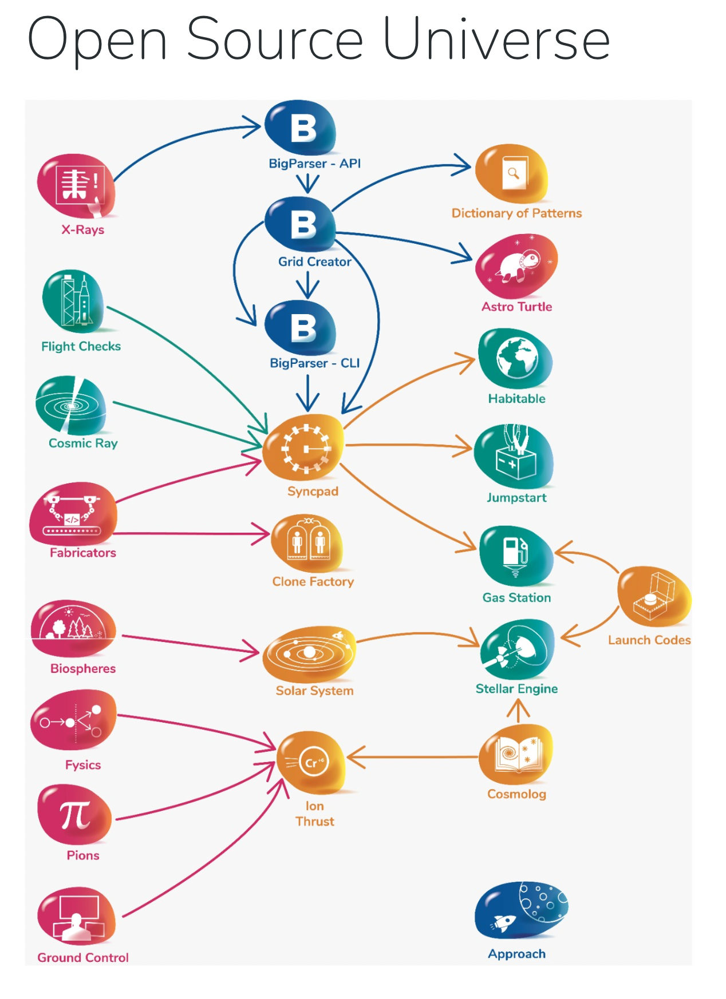

# approach

## Table of Contents

- [approach](#approach)
  - [Table of Contents](#table-of-contents)
  - [Our Mission](#our-mission)
  - [Our Vision](#our-vision)
    - [Project Categories](#project-categories)
    - [The Open Source Universe](#the-open-source-universe)
  - [Principles](#principles)

## Our Mission

At Intellibus, Our Mission to `Make Life Simple`.

We do that by `Making Platforms Intelligent`.

## Our Vision

Our Vision is for a world where anyone can build Intelligent Platforms.

To enable that vision, we are creating the Open Source Universe for the Developer Community.

### Project Categories

Our Projects fall into 4 main categories.

1. Blue = Big Picture — Open Data & APIs
2. Green = Templates — Reliable & Quick Start
3. Red = Components — Safe & Stable Libraries
4. Yellow = Frameworks — Connects & Learns

### The Open Source Universe

When creating the Platforms of the Future, Engineers can adopt one or many of the Projects in the Open Source Universe.

However, the Open Source Universe works better as a connected whole.

In the diagram below we have the dependency graph for the Projects in the Open Source Universe.

## Principles

All Projects in the Open Source Universe should follow the Principles of the Open Source Universe.

1. 100% Code Coverage — Write Unit Tests which cover all functionality in the Project
2. Automated Releases via CI/CD — Release to all Registries via CI/CD Pipeline
3. Explicit Versioning of All Dependencies — All tooling must have an explicit version # defined.
4. Automated Dependency Management — Automatically Open & Test a PR w/ new deps. Auto-release on Pass.
5. Commits as Source of Truth — Release Notes & Version # changes are based on commit messages
6. Code Quality checks Pre-Commit — Run linters & formatters as a pre-commit hook
