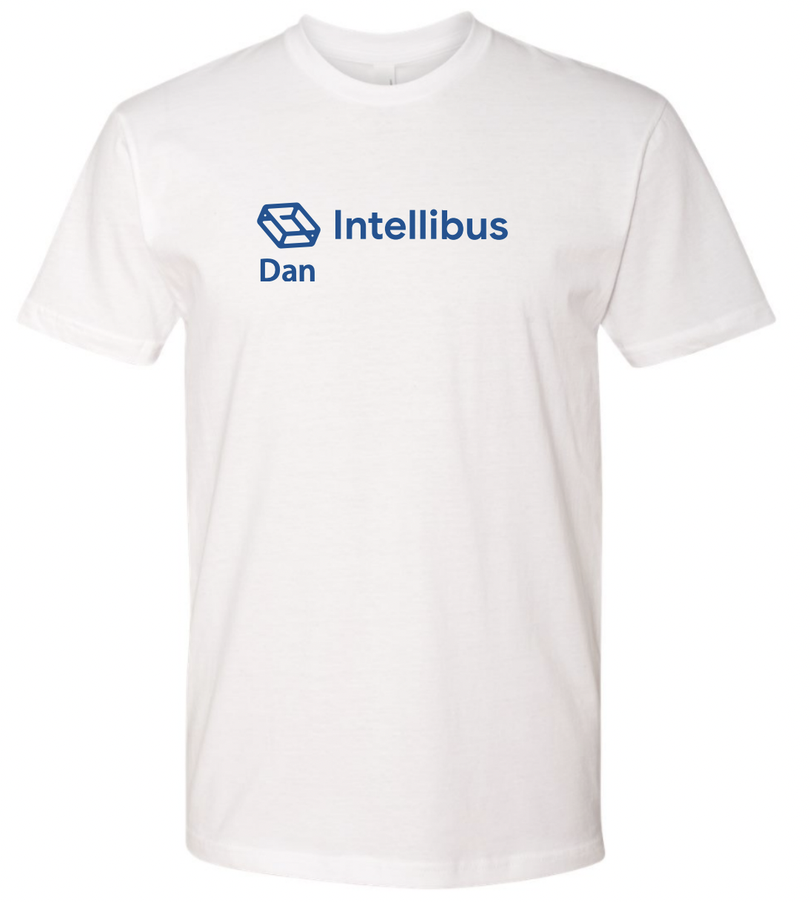
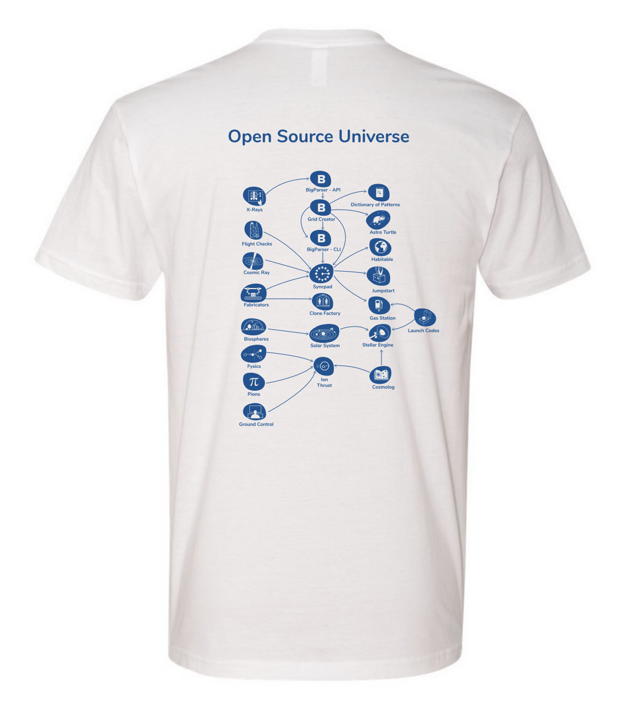

# Open Source Universe Rewards

## Create a Pull Request 🏆

**Reward**: A Personalized [Open Source Universe](https://github.com/intellibus/approach) T-Shirt

| Front                                                    | Back                                    |
| -------------------------------------------------------- | --------------------------------------- |
|  |  |

How to Claim Your Reward 🌟

1. Open a Pull Request on an [Open Source Universe](https://github.com/intellibus/approach) Project
2. Your Pull Request Passes All Required Checks
3. Your Pull Request is Merged onto the `main` branch[^1]
4. You have sent us your T-Shirt Size & Contact Details via this [Google Form](https://forms.gle/2gXJyYSyVTX6hA3eA).
5. All Shipping & Handling will be paid for, & you should receive a tracking number # within a week of sending us your contact details.

[^1]: This step is waived if you have shared your Contact Details & GitHub Username with the Intellibus Open Source Team during an In-Person Conference
